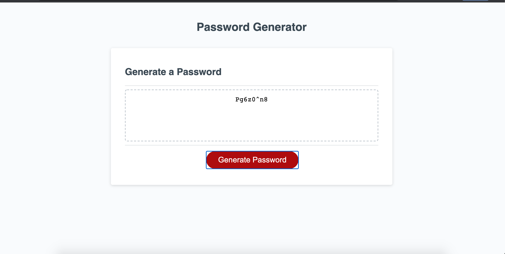

# PasswordGenerator
<strong> Project Summary: </strong>  
This is single page web application which generates Password based on user selected criteria.

      

 
<strong> Description: </strong>  
User would be able to set length of password (between 8 & 128) and select password criteria (Upper-case, Lower-case, Numbers and Special). Based on selected criterial and length , new password is generated each time.  

<strong> Purpose: </strong>  
Generate unique password each time with selected criteria.   

<strong> Code Installation: </strong>  
$ cd [path_to_save_codebase]  
$ git clone https://github.com/arti-karnik/PasswordGenerator  

<strong> Github Profile: </strong>  
https://github.com/arti-karnik

<strong> Application Live URL: </strong>  
https://arti-karnik.github.io/PasswordGenerator/
